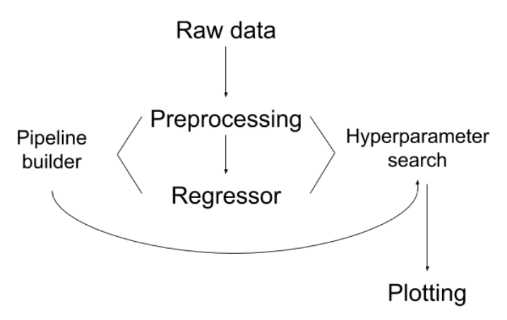
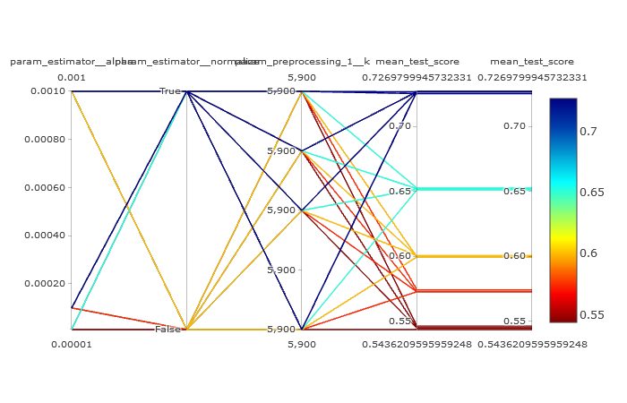

# Introduction
{:.no_toc}

<!-- This is a comment. -->

In order to perform a predictive analysis Bioinformatics logically relies on [Machine Learning](https://en.wikipedia.org/wiki/Machine_learning) algorithms. In this tutorial the analysis on real data is split into two essential parts of Machine Learning pipeline, which we demostrate by using Galaxy tools. First we do some Preprocessing by optimizing hyperparameters (their optimal settings), which are expected to produce the best results on the RNA-seq dataset of fibroblast cell lines proposed in the [paper](https://genomebiology.biomedcentral.com/articles/10.1186/s13059-018-1599-6#Sec9). The second part of the tutorial is dedicated thoroughly to the age prediction task and for that we suggest to use the DNAm data from the [paper](https://www.sciencedirect.com/science/article/pii/S1872497317301643?via%3Dihub).


> ### Agenda
>
> In this tutorial, we will cover:
>
> 1. TOC
> {:toc}
>
{: .agenda}

# Preparing the data

The data on which we perform our first task of hyperparameter estimation is a RNAseq data of firoblast cell lines belonging to 133 healthy patients
of age from 1 to 94 years and to other 10 patients diagnosed with HGPS (Hutchinson-Gilford progeria syndrome). On this data we perform exhaustive search
for optimal parameters settings (known as Grid Search) for ElasticNet regressor and compare the results with the estimations found in the [original paper](https://genomebiology.biomedcentral.com/articles/10.1186/s13059-018-1599-6#Sec9).

## Get the raw data

We proceed to the analysis with uploading the data.

> ###  Hands-on: Data upload
>
> 1. Create a new history for this tutorial
> 2. Import the files from [Zenodo]()
>
>    ```
>    https://zenodo.org/api/files/0d468136-5025-4c0f-bf8b-a8277a513a93/training_data_normal.tsv
>    ```
>
>    
>
> 3. Rename the dataset to `training_data_normal`.
>
>    
>
> 4. Check that the datatype is `.tsv`
>
>    
>
{: .hands_on}

# Pre-processing

The Machine Learning pipeline for this tutorial can be summed up in the following diagram. We can see that Hyperparameter optimization step considers not only a pre-processed data, but we also can estimate parameters used further in a regressor:



## Pre-processing with *Pipeline Builder*

The next essential step is to pre-process the raw data with **Pipeline Builder** tool, where we can choose our settings for a Feature Selection component and setup settings for Elastic Net regressor. This tool will perform the needed transformations on the input data and prepare it for the chosen analysis.

> ###  Hands-on: Data pre-processing
>
> 1. **Pipeline Builder**  with the following parameters:
>    - In *"1: Pre-processing step:"*:
>        - *"Choose the type of transformation:"*: `Feature Selection`
>            - *"Select a feature selection algorithm:"*: `SelectKBest - Select features according to the k highest scores`
>                - *"Select a score function:"*: `f_regression - Univariate linear regression tests`
>    - In *"Final Estimator:"*:
>        - *"Choose the module that contains target estimator:"*: `sklearn.linear_model`
>            - *"Choose estimator class:"*: `ElasticNet`
>
>    > ###  Comment
>    >
>    > *ElasticNet* is a regularization method that combines lasso and ridge regression approaches. 
>    {: .comment}
>
{: .hands_on}

## Hyperparameter estimation

[Hyperparameter estimation](https://en.wikipedia.org/wiki/Hyperparameter_optimization) is a tuning step in a Machine Learning
pipeline where the optimal settings, such as parameters, should be found. In general, there are many approaches for doing so,
worth mentioning for our tutorials:
- Grid Search
- Random Search
- and others

For our purposes we will use grid search approach, which is an exhaustive method that suggests to 'sweep' through a pre-defined
subset of possible values, trying to optimize the performace. Typically, it is done either with a cross-validation, or using a
held-out set.

> ###  Cross-validation and held-out set
>
> *Cross-validation* is a well-known model validation technique, which allows to estimate a performance on an independent data. The
idea of this approach is to rotate a partitioning of a training and a validation data so later the results can be averaged over folds.
>
> *Held-out set* is another approach aiming to retain some data unseen for the performance estimations. It is done by 'locking' the subset of data.
>
{: .details}

Let's now perform a Grid Search to estimate settings for following parameters: **k**, **normalize**, **alpha**. For each of these
we have to suggest a subset of values to perform a search on:
- **k**: [5880, 5890, 5895, 5900]
- **normalize**: True or False
- **alpha**: [0.00001, 0.0001, 0.001]

You might have noticed that parameters **normalize** and **alpha** are used in the regressor.

> ###  Hands-on: Task description
>
> 1. **Hyperparameter Search**  with the following parameters:
>    - *"Select a model selection search scheme:"*: `GridSearchCV - Exhaustive search over specified parameter values for an estimator `
>        - In *"Search parameters Builder"*:
>            - In *"Parameter setting for search:"*:
>                -  *"Insert Parameter setting for search:"*
>                    - *"Choose the transformation the parameter belongs to"*: `Pre-processing step #1`
>                        - *"Pre_processing component #1  parameter:"*: `k: [5880, 5890, 5895, 5900]`
>                -  *"Insert Parameter setting for search:"*
>                    - *"Choose the transformation the parameter belongs to"*: `Final estimator`
>                        - *"Estimator parameter:"*: `normalize: [True, False]`
>                -  *"Insert Parameter setting for search:"*
>                    - *"Choose the transformation the parameter belongs to"*: `Final estimator`
>                        - *"Estimator parameter:"*: `alpha: [0.00001, 0.0001, 0.001]`
>        - In *"Advanced Options for SearchCV"*:
>            - *"Select the primary metric (scoring):"*: `Regression -- 'r2'`
>            - *"Select the cv splitter:"*: `KFold`
>                - *"n_splits"*: `5`
>                - *"Whether to shuffle data before splitting"*: `Yes`
>                - *"Random seed number"*: `3111696`
>            - *"Raise fit error:"*: `Yes`
>    - *"Select input type:"*: `tabular data`
>        - *"Does the dataset contain header:"*: `Yes`
>        - *"Choose how to select data by column:"*: `All columns BUT by column header name(s)`
>            - *"Type header name(s):"*: `age`
>        - *"Does the dataset contain header:"*: `Yes`
>        - *"Choose how to select data by column:"*: `Select columns by column header name(s)`
>            - *"Type header name(s):"*: `age`
>
>    > ###  Comment
>    >
>    > The tool returns two outputs, one of which is a table with numerical results. Inspect it carefully: the last column shows the ranking of settings
based on performance. The ranking is based on the the 14th column where you can find mean test score and the values for parameters which output this result
are visible in the 8th column.
>    {: .comment}
>
{: .hands_on}

> ###  Questions
>
> 1. What is the 'best' possible mean_test_score estimated by the tool for these parameters?
> 2. Which combination of parameter settings gives it?
> 3. How many combinations of possible parameters the tool estimated?
>
> > ###  Solution
> >
> > 1. 0.7269799945732331
> > 2. alpha: 0.001, normalize: True, k: 5880
> > 3. 24
> >
> {: .solution}
>
{: .question}

## *Parallel Coordinates Plot*

In order to make the results more appealing to look at, we will visialize them with the tool **Parallel Coordinates Plot of tabular data**.

> ###  Hands-on: Task description
>
> 1. **Parallel Coordinates Plot**  with the following parameters:
>    - *"Select the columns for dimentions:"*: `c[5, 6, 7, 14]`
>    - *"Select a column containg the values for coloring:"*: `c14`
>
>    > ###  Comment
>    >
>    > The output plot has the following legend: the colour-coding is based on the mean_test_score column. You can follow the 'line' leading
to the score along every column with parameters' settings.
>
>    
>
>    {: .comment}
>
{: .hands_on}

> ###  Questions
>
> 1. What can you notice about the least performing (let's say least four) hyperparameters' settings (judging by the plot)?
>
> > ###  Solution
> >
> > 1. The four 'worst' settings are:
> > - alpha: 0.00001, normalize: False, k: 5880;
> > - alpha: 0.00001, normalize: False, k: 5890;
> > - alpha: 0.00001, normalize: False, k: 5895;
> > - alpha: 0.00001, normalize: False, k: 5900
> >
> > We can notice that the only parameter that differs is the value of **k**.
> >
> {: .solution}
>
{: .question}

# Preparing for the prediction

This second part of the analysis is covering the age prediction task. We start with repeating the same already familiar steps from the first part of the tutorial to estimate hyperparameters. The next stage is the actual training, using the tool for ensemble methods for classification and regression. Then we
compare the results with available test labels in order to calculate residuals.

## Get the train and test data

We proceed to the analysis with uploading new data. You might want to create a new history first.

> ###  Hands-on: Data upload
>
> 1. Create a new history for this tutorial
> 2. Import the files from [Zenodo]()
>
>    ```
>    https://zenodo.org/api/files/0d468136-5025-4c0f-bf8b-a8277a513a93/test_rows.csv
>    https://zenodo.org/api/files/0d468136-5025-4c0f-bf8b-a8277a513a93/test_rows_labels.csv
>    https://zenodo.org/api/files/0d468136-5025-4c0f-bf8b-a8277a513a93/train_rows.csv
>    ```
>
>    
>
> 3. Rename the datasets accordingly.
>
>    
>
> 4. Check that the datatypes.
>
>    
>
>    > ###  Comment
>    >
>    > The `train_rows.csv` contains an additional column with ages, which is used for the training. We will estimate our model on
>    > `test_rows.csv` and compare the predicted age with labels in `test_rows_labels.csv`
>
>    {: .comment}
{: .hands_on}

## Pre-processing with *Pipeline Builder*

We move on to pre-processing with re-running **Pipeline Builder** on the new data to setup the [Gradient Boosting Regressor](https://scikit-learn.org/stable/modules/generated/sklearn.ensemble.GradientBoostingRegressor.html).

> ###  Hands-on: Data pre-processing
>
> 1. **Pipeline Builder**  with the following parameters:
>    - In *"Final Estimator:"*:
>        - *"Choose the module that contains target estimator:"*: `sklearn.ensemble`
>            - *"Choose estimator class:"*: `GradientBoostingRegressor`
>
>    > ###  Comment
>    >
>    > [*Ensemble*](https://en.wikipedia.org/wiki/Ensemble_learning) methods allow to use several learning models for better predictions. 
>    {: .comment}
>
{: .hands_on}

## *Hyperparameter Search*: the training

Before we can start testing, we need to train the model on the input data. At the same time the familiar **Hyperparameter Search** tool allows to estimate the optimal number of learners for the ensemble, which is a hyperparameter.

> ###  Hands-on: Task description
>
> 1. **Hyperparameter Search**  with the following parameters:
>    - *"Select a model selection search scheme:"*: `GridSearchCV - Exhaustive search over specified parameter values for an estimator `
>        - In *"Search parameters Builder"*:
>            - In *"Parameter setting for search:"*:
>                -  *"Insert Parameter setting for search:"*
>                    - *"Choose the transformation the parameter belongs to"*: `Final estimator`
>                        - *"Estimator parameter:"*: `n_estimators: [25, 50, 75, 100, 200]`
>        - In *"Advanced Options for SearchCV"*:
>            - *"Select the primary metric (scoring):"*: `Regression -- 'r2'`
>            - *"Select the cv splitter:"*: `KFold`
>                - *"n_splits"*: `5`
>                - *"Whether to shuffle data before splitting"*: `Yes`
>                - *"Random seed number"*: `3111696`
>            - *"Raise fit error:"*: `Yes`
>    - *"Select input type:"*: `tabular data`
>        - *"Does the dataset contain header:"*: `Yes`
>        - *"Choose how to select data by column:"*: `All columns BUT by column header name(s)`
>            - *"Type header name(s):"*: `Age`
>        - *"Does the dataset contain header:"*: `Yes`
>        - *"Choose how to select data by column:"*: `Select columns by column header name(s)`
>            - *"Type header name(s):"*: `Age`
>
{: .hands_on}

> ###  Questions
>
> 1. What is the predicted optimal number of estimators?
>
> > ###  Solution
> >
> > 1. 75
> >
> {: .solution}
>
{: .question}

> ###  Hands-on: Task description
>
> 1. **Parallel Coordinates Plot**  with the following parameters:
>    - *"Select the columns for dimentions:"*: `c[5, 12]`
>    - *"Select a column containg the values for coloring:"*: `c12`
>
{: .hands_on}

> ###  Questions
>
> 1. What hyperparameter value returned the lowest mean_test_score (according to the plot)?
>
> > ###  Solution
> >
> > 1. n = 25
> >
> {: .solution}
>
{: .question}

# Ensemble prediction

Now when we prepared the trained model, the actual prediction can be launched.

> ###  Hands-on: Task description
>
> 1. **Ensemble methods for classification and regression**  with the following parameters:
>    - *"Select a Classification Task:"*: `Load a model and predict`
>        - *"Models"*: to the `output from Hyperparameter Search`
>        - *"Data (tabular)"*: `test_rows.csv`
>        - *"Does the dataset contain header:"*: `Yes`
>        - *"Select the type of prediction:"*: `Predict class labels`
>
{: .hands_on}

Let's plot the predictions and compare with the test labels.

> ###  Hands-on: Task description
>
> 1. **Plot actual vs predicted curves and residual plots of tabular data**  with the following parameters:
>    - *"Select input data file :"*: `test_rows_labels.csv`
>    - *"Select predicted data file :"*: to the `output from the previous tool`
>
>    > ###  Comment
>    >
>    > The tool outputs three html files with the interactive plots.
>    {: .comment}
>
{: .hands_on}

> ###  Questions
>
> 1. Inspect the plots. What can you say about our predictions?
>
> > ###  Solution
> >
> > 1. The predictions (marked orange) show good results.
> >
> {: .solution}
>
{: .question}


# Conclusion
{:.no_toc}

Sum up the tutorial and the key takeaways here. We encourage adding an overview image of the
pipeline used.
